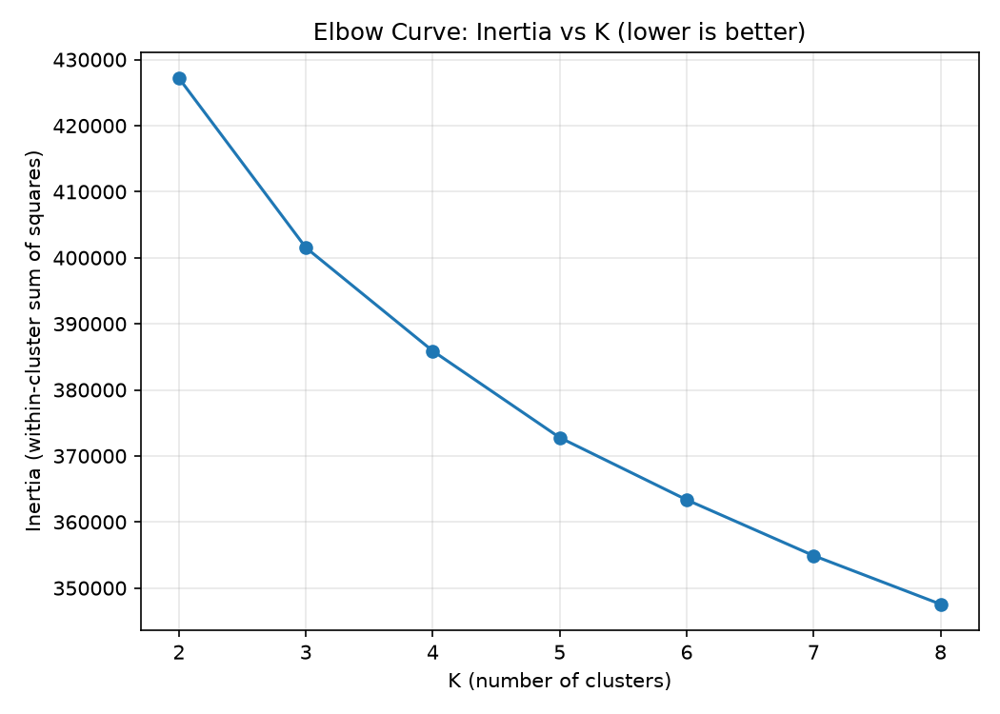
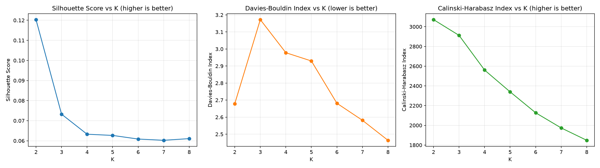
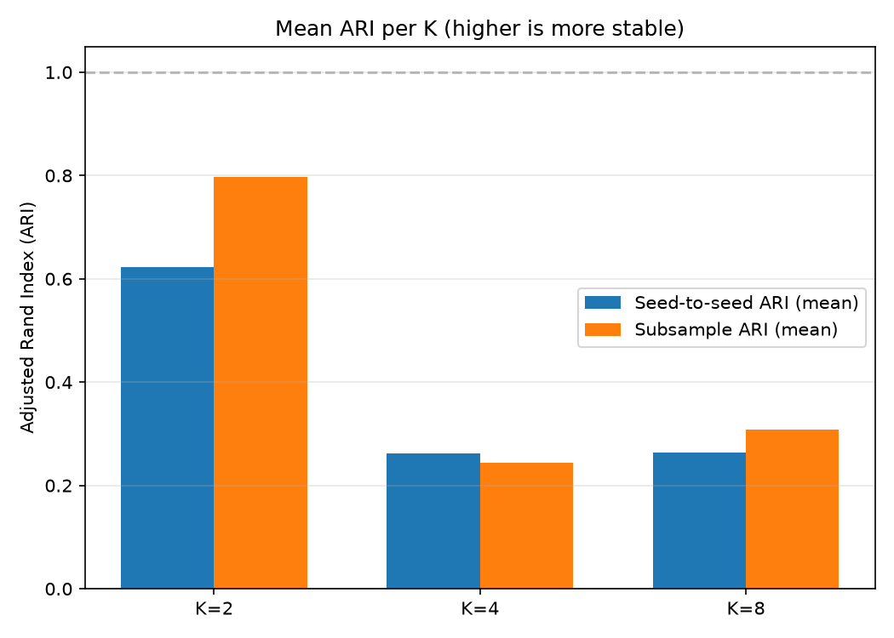
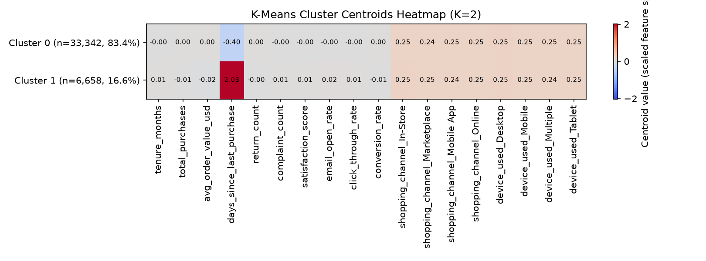

# K-Means Clustering (Hard-Clustering Baseline)

Owner: Kawya | Notebook: [notebooks/02_KMeans.ipynb](../notebooks/02_KMeans.ipynb)

## 1. Role in the Project

K-Means is the hard-clustering baseline that the soft models (GMM, Fuzzy C-Means) are compared against. It assigns exactly one cluster label per customer, with no membership probabilities — so it cannot produce the Segment Ambiguity Score the soft models can. That limitation is exactly why it serves as the baseline: it establishes what a simple, industry-standard hard partition of the customer base looks like, against which the soft models' extra information (membership/uncertainty) can be shown to add value.

## 2. Data Used

- Frozen shared data: `development_preprocessed.csv` (40,000 rows × 18 model features + `customer_id`) and `holdout_preprocessed.csv` (10,000 rows × 18 model features + `customer_id`), an 80/20 development/holdout split with `random_state=42`.
- `customer_id` is dropped from the model matrix before fitting — kept only to align cluster assignments back to customers.
- `customer_lifetime_value_usd` and `churn_risk_score` are excluded from clustering entirely (they live in the separate `*_business_data.csv` files). They're kept for later business prioritisation, not fed into the model — including them would let the clustering partly be defined by the very metrics later used to profile/validate it, which is circular.
- No preprocessing is refit here: both files are already scaled/encoded by the shared `01_EDA_Preprocessing.ipynb` pipeline, fit on the development set only.

## 3. Method (step by step)

1. **Setup & data loading** — load the frozen dev/holdout CSVs, split off `customer_id`, build the feature matrices `X_dev`/`X_hold`, and assert no CLV/churn/`customer_id` leakage and identical dev/holdout columns.
2. **Baseline K sweep (K=2..8)** — fit K-Means with a fixed config (`init='k-means++'`, `n_init=10`, `max_iter=300`, `random_state=42`) for each K; record inertia, silhouette (10,000-row sample), Davies-Bouldin, Calinski-Harabasz, iteration count, runtime, and cluster-size balance.
3. **Candidate K selection** — pick 2-3 candidate K values programmatically: best silhouette, best (lowest) Davies-Bouldin, and the elbow region (geometric knee detection on the inertia curve).
4. **Hyperparameter tuning** — grid-search `init ∈ {k-means++, random}` × `n_init ∈ {1,5,10,20}` for the candidate K values only, with an automatic `max_iter=500` re-run for any configuration that hit the 300-iteration cap.
5. **Stability analysis** — for each candidate K's best tuned config, refit with 10 random seeds (pairwise Adjusted Rand Index across all seed pairs) and on 5 random 80% subsamples (ARI of each subsample-fitted model's full-dev predictions against a reference labeling).
6. **Best-configuration selection** — apply explicit rules (reject degenerate clusters <5%, reject mean ARI <0.9, rank survivors by average rank of silhouette/DB/CH, elbow as supporting context) to choose a single configuration.
7. **Holdout evaluation** — `.predict()` the chosen model on the untouched holdout set (no refitting) and compare dev vs holdout metrics.
8. **Cluster profiling** — centroid heatmap and top distinguishing features per cluster, in the scaled feature space (CLV/churn joined later at group level, not here).
9. **Save artifacts** — persist the model, cluster assignments, and a structured summary record for `06_Model_Comparison.ipynb`.

## 4. Baseline Results

Config: `init='k-means++'`, `n_init=10`, `max_iter=300`, `random_state=42`. Silhouette computed on a 10,000-row sample.

| K | inertia | silhouette | DB | CH | min cluster % | runtime (s) |
|---|---|---|---|---|---|---|
| 2 | 427,185.98 | 0.1203 | 2.6792 | 3,072.20 | 16.65% | 0.34 |
| 3 | 401,526.18 | 0.0732 | 3.1726 | 2,912.27 | 15.04% | 0.27 |
| 4 | 385,884.89 | 0.0633 | 2.9784 | 2,560.54 | 14.31% | 0.38 |
| 5 | 372,774.27 | 0.0627 | 2.9299 | 2,339.57 | 13.78% | 0.45 |
| 6 | 363,354.52 | 0.0609 | 2.6816 | 2,127.48 | 13.19% | 0.59 |
| 7 | 354,903.87 | 0.0602 | 2.5816 | 1,973.79 | 12.72% | 0.83 |
| 8 | 347,555.41 | 0.0611 | 2.4643 | 1,848.34 | 12.35% | 0.93 |

Candidate K values selected for tuning: **K=2** (best silhouette), **K=8** (best/lowest Davies-Bouldin), **K=4** (elbow region).

## 5. Hyperparameter Tuning

Grid tested: `init ∈ {k-means++, random}` × `n_init ∈ {1, 5, 10, 20}` × `max_iter=300`, for K ∈ {2, 4, 8} only (24 runs), plus one automatic re-run at `max_iter=500` for the single configuration that hit the 300-iteration cap (K=8, `random`, `n_init=20`, which reached `n_iter_=300`; at `max_iter=500` it converged at `n_iter_=301` with silhouette 0.05942 vs 0.05942 at the cap — no meaningful change).

Best tuned configuration per candidate K (by silhouette):

| K | tuned init | tuned n_init | silhouette (tuned) | vs. baseline |
|---|---|---|---|---|
| 2 | k-means++ | 10 | 0.1203 | same as baseline — tuning found no better config |
| 4 | random | 5 | 0.0635 | marginal improvement over baseline's 0.0633 (k-means++, n_init=10) |
| 8 | k-means++ | 5 | 0.0611 | same result as baseline (n_init=10), but n_init=5 is cheaper for identical quality |

## 6. Stability Analysis

Per candidate K's best tuned config: 10 random seeds (pairwise ARI across all seed pairs) and 5 random 80% subsamples of the development set (ARI of each subsample-fitted model's full-dev predictions vs. a reference labeling).

| K | pairwise seed ARI (mean) | pairwise seed ARI (min) | subsample ARI (mean) | subsample ARI (min) |
|---|---|---|---|---|
| 2 | 0.6221 | ≈0.0000 | 0.7970 | ≈0.0001 |
| 4 | 0.2616 | 0.1453 | 0.2436 | 0.1440 |
| 8 | 0.2632 | 0.1787 | 0.3085 | 0.2258 |

ARI ≈ 1 means the model finds essentially the same clusters every time; ARI ≈ 0 means agreement no better than chance. None of the three candidates are reliably stable: K=2 is the closest, but even it has at least one seed-pair and one subsample run landing near ARI≈0, meaning a second, roughly-equally-good 2-way split of the customers also exists. K=4 and K=8 are clearly unstable — notably, their inertia and silhouette barely move across the 10 seeds (std < 0.05% of the mean), meaning K-Means reliably finds a solution of the *same quality* each time but lands on a *different partition* — the signature of multiple near-equally-good partitions rather than one well-defined cluster structure.

## 7. Best Configuration & Justification

Selection rules, applied in order:
1. Reject any K with a cluster holding < 5% of customers (degenerate).
2. Reject any K with mean ARI < 0.9 (unstable), where mean ARI = average of the pairwise-seed-ARI mean and the subsample-ARI mean.
3. Among survivors, rank by average rank across silhouette, Davies-Bouldin, and Calinski-Harabasz; use the elbow region (K=4) as supporting context, not a hard filter.

Result: **no K-Means configuration survived Rule 2.**

| K | min cluster % | mean ARI | Rule 1 | Rule 2 |
|---|---|---|---|---|
| 2 | 16.65% | 0.7096 | pass | **fail** (< 0.9) |
| 4 | 14.34% | 0.2526 | pass | **fail** (< 0.9) |
| 8 | 12.35% | 0.2859 | pass | **fail** (< 0.9) |

Rule 3 (ranking) was never reached because nothing survived Rule 2.

This is a legitimate negative result, not a tuning failure: the behavioral features used here don't appear to contain well-separated, hard clusters at any evaluated K, under the group's required stability bar.

**Decision — best-effort final model:** despite failing Rule 2, the group decided to still produce a final K-Means model for cross-model comparison and artifact purposes, using **K=2** — the closest-to-stable candidate (mean ARI=0.7096, highest silhouette among the three). It is refit on the full development set (same config as baseline: `init='k-means++'`, `n_init=10`, `max_iter=300`, `random_state=42`) and carried through Sections 8-9 and the saved artifacts below. This is **not** a validated stable configuration — a different random seed can produce a meaningfully different 2-way split (ARI as low as ≈0 was observed against at least one seed and one subsample in Section 6) — so the metrics below should be read as illustrative, not as evidence of a reliable customer segmentation. `kmeans_summary.json`'s `status` field records this explicitly as `"best_effort_unstable_configuration"` (`is_stable_selection: false`), distinct from a true `"stable_configuration_selected"` outcome.

## 8. Holdout Evaluation

`.predict()` only, no refitting, on the best-effort K=2 model:

| metric | development | holdout | abs diff |
|---|---|---|---|
| silhouette | 0.1203 | 0.1246 | 0.0042 |
| davies_bouldin | 2.6792 | 2.6604 | 0.0188 |
| calinski_harabasz | 3,072.2 | 795.5 | 2,276.6 |
| min_cluster_pct | 16.65% | 16.96% | 0.31 pp |
| max_cluster_pct | 83.36% | 83.04% | 0.31 pp |

Silhouette, Davies-Bouldin, and cluster-size balance all generalise closely to the holdout set. Calinski-Harabasz drops sharply (as expected — it scales with sample size, and holdout is a quarter the size of development), so it isn't a meaningful generalisation signal on its own here.

## 9. Cluster Profiles

Centroid heatmap for the best-effort K=2 model (scaled feature space):

Cluster sizes: Cluster 0 = 33,342 (83.4%), Cluster 1 = 6,658 (16.6%).

Top 3 distinguishing features by |centroid value|:

| Cluster | Feature 1 | Feature 2 | Feature 3 |
|---|---|---|---|
| 0 (n=33,342, 83.4%) | `days_since_last_purchase`: −0.405 | `device_used_Desktop`: +0.254 | `shopping_channel_Mobile App`: +0.252 |
| 1 (n=6,658, 16.6%) | `days_since_last_purchase`: +2.026 | `device_used_Desktop`: +0.254 | `shopping_channel_In-Store`: +0.254 |

Cluster 1 is a small group of customers who purchased far longer ago than average (+2.03 SD on `days_since_last_purchase`); Cluster 0 is everyone else, skewed slightly toward more-recent purchasers. Given the instability flagged in Section 7, treat this as one illustrative partition rather than a definitive recency-based segmentation.

## 10. Limitations

- Hard labels only — no ambiguity/uncertainty information per customer, unlike the soft models.
- Assumes roughly spherical, similar-size clusters (Euclidean distance), which may not match this data's true structure.
- Sensitive to initialisation (mitigated here by `k-means++` and `n_init` > 1, per Section 5).
- Silhouette is computed on a 10,000-row sample for runtime, consistent with the group's shared setting (`SIL_SAMPLE`).
- Dataset likely synthetic.

## 11. Artifacts

| Path | Contents |
|---|---|
| `results/kmeans/kmeans_baseline_results.csv` | Baseline K=2..8 metrics (inertia, silhouette, DB, CH, n_iter_, runtime, cluster sizes) |
| `results/kmeans/kmeans_tuning_results.csv` | 25-run `init`×`n_init` grid results for candidate K=2,4,8 |
| `results/kmeans/kmeans_stability_results.csv` | Per-K seed/subsample ARI and seed-metric mean/std |
| `results/kmeans/kmeans_summary.json` | Structured summary record (status: `best_effort_unstable_configuration`, `is_stable_selection: false`); baseline, tuning, stability, selection-rule detail, plus `best_config`/`common_metrics`/`holdout_metrics` for the best-effort K=2 model |
| `results/figures/kmeans/kmeans_elbow_curve.png` | Inertia vs K |
| `results/figures/kmeans/kmeans_metrics_vs_k.png` | Silhouette / DB / CH vs K |
| `results/figures/kmeans/kmeans_stability_ari.png` | Mean ARI per K (seed vs subsample) |
| `models/kmeans_final_model.pkl` | Best-effort final model (K=2) — fails the stability bar, saved for cross-model comparison per the group's decision |
| `results/kmeans/kmeans_dev_assignments.csv` | Development-set cluster assignments from the best-effort K=2 model |
| `results/kmeans/kmeans_holdout_assignments.csv` | Holdout-set cluster assignments (`.predict()` only) from the best-effort K=2 model |
| `results/figures/kmeans/kmeans_cluster_centroids_heatmap.png` | Centroid heatmap for the best-effort K=2 model |

## 12. Viva Notes (Key Concepts)

- **How K-Means works**: initialise K centroids, assign each customer to the nearest centroid, recompute each centroid as the mean of its assigned customers, repeat until assignments stop changing (or `max_iter` is reached).
- **Inertia & elbow**: inertia is the sum of squared distances from each customer to its nearest centroid. It always decreases as K increases, so the "elbow" — where the gains flatten — is a guide for choosing K, not a decision on its own.
- **Why scaling matters**: K-Means uses Euclidean distance, so any feature with a larger numeric range would dominate the distance calculation unless all features are scaled first (handled upstream by the shared preprocessing pipeline).
- **How K was investigated**: K=2 through 8 were swept and compared on inertia, silhouette, Davies-Bouldin, Calinski-Harabasz, cluster-size balance, and stability — K was not assumed in advance.
- **Why K-Means is the baseline**: it's the industry-standard hard-clustering algorithm, so the project's soft models are tested against it. Because it only outputs one hard label per customer with no membership probabilities, it cannot produce a Segment Ambiguity Score — exactly the gap the soft models are meant to fill.
- **How stability was assessed**: pairwise Adjusted Rand Index (ARI) across 10 different random seeds, plus ARI between a reference labeling and models fit on 5 random 80%-subsamples of the development set.
- **How holdout customers are assigned**: by calling `.predict()` to find each holdout customer's nearest *already-learned* centroid — no refitting on holdout data.
- **Metric meanings**: silhouette (higher is better, range -1 to 1, measures how much closer a point is to its own cluster than the next-nearest one); Davies-Bouldin (lower is better, ratio of within-cluster to between-cluster distances); Calinski-Harabasz (higher is better, ratio of between-cluster to within-cluster dispersion).
